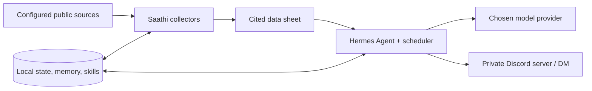

# Saathi

> Your own AI companion - self-hosted, on your own server, for $0.

“Saathi” is Hindi for “companion.” It is an open-source kit for a personal research agent: it watches sources you choose, prepares
citation-ready data sheets, asks [Hermes Agent](https://github.com/NousResearch/hermes-agent) to summarise
them, and delivers private reports in Discord. It is a customisable, self-hosted alternative that you own.

Your memory, files, skills, schedules, state, and credentials live on your server. Prompts and the data in
them still go to the model provider you choose; free cloud providers may log prompts. For maximum privacy,
run Hermes against Ollama on a capable machine you control. An always-free `e2-micro` VM cannot run useful
local language models.



## What costs $0

The intended path uses Google Cloud's always-free eligible `e2-micro`, standard persistent disk, public
feeds/APIs, and a currently free Nous Portal model. Free-tier terms, model availability, outbound traffic,
external IPv4 pricing, and taxes can change. A budget alert is a warning, not a spending cap. See
[costs](docs/costs.md) before creating anything.

> **Before you add a card anywhere, read [Billing safety](docs/billing-safety.md).** Google Cloud and Oracle
> require a card even for free tiers. Use a virtual or limited card with a low spending limit, never add a
> card or credits to Nous Portal or OpenRouter (a $0 balance makes paid calls fail instead of billing you),
> and set Modal's spending limit before connecting it.

## Options

The default $0 stack is Hermes Agent + Nous Portal free models + a GCP `e2-micro` + local command
execution + Discord, with yfinance and optional TradingAgents for markets. Every layer is replaceable.
[Choosing your stack](docs/choosing-your-stack.md) compares runtimes, coding frameworks, memory, web/data
tools, market tools, models, hosting, execution backends, and chat front ends, including RAM, privacy,
licence, cost, and the swaps that need code.

The checked-in `config/stack.example.yaml` records the selected runtime, model endpoint, terminal backend,
and notifier. Source types and collectors are registry-driven. The bootstrap model provider and terminal
backend can also be overridden with environment variables; a different notification transport can reuse
Hermes delivery by changing `notifier.target_prefix`, while automatic setup for a non-Discord service needs
a small adapter.

## Prerequisites

You need a Google account with a payment card for verification (ideally a virtual or limited card; see
[Billing safety](docs/billing-safety.md)), a Discord account, and a Mac or Linux shell
with `git` and the Google Cloud CLI. You also need a dedicated SSH key:

```bash
ssh-keygen -t ed25519 -f ~/.ssh/saathi -C saathi
```

This keeps automation access separate from your everyday SSH identity.

## 1. Create the free VM and guardrails

Choose an eligible zone in `us-west1`, `us-central1`, or `us-east1`. The script fixes the settings that are
easy to get wrong: standard (not Spot) provisioning, `pd-standard` (not billed Balanced), 30 GB, Ubuntu
24.04 amd64, and no cloud service account.

```bash
export GCP_PROJECT='your-project'
export GCP_ZONE='us-west1-b'
export SAATHI_SSH_PUBLIC_KEY="$HOME/.ssh/saathi.pub"
export SSH_SOURCE_RANGE='your-public-address/32'
export SAATHI_DISABLE_DEFAULT_FIREWALL_RULES=yes
bash deploy/gcp/create-vm.sh
```

The last flag authorizes deletion of the default network's permissive `default-allow-ssh` and
`default-allow-rdp` rules. Without that deletion, the restricted `saathi-ssh` rule does not protect the VM.
The script refuses to continue non-interactively when those rules exist and the flag is absent. It also
describes the VM and firewall rule before creating them, so reruns skip resources already present.

`SSH_SOURCE_RANGE` is intentionally restrictive. If your home public IP changes, update the rule before
trying to reconnect: `gcloud compute firewall-rules update saathi-ssh --source-ranges=NEW_IP/32`. Keep an
existing SSH session open while changing it.

Create a small budget in the billing account's currency. For example, a Canadian billing account needs an
amount such as `1CAD`, not `1USD`:

```bash
export GCP_BILLING_ACCOUNT='your-billing-account'
export GCP_BUDGET_AMOUNT='1CAD'
bash deploy/gcp/budget.sh
```

Oracle Always Free is another option, but sign-up can fail despite a valid card and A1 capacity is often
unavailable. Trying another availability domain, a smaller shape, or PAYG may help; GCP is the documented
fallback. External IPv4 addresses may now be billed—check current pricing before leaving one attached.

## 2. Harden the server

SSH in with the dedicated key, clone this repository, and run:

```bash
sudo SAATHI_TIMEZONE='America/Los_Angeles' bash deploy/bootstrap/server-harden.sh
```

The idempotent script creates a non-root `hermes` user, copies the current authorized keys, disables SSH
password/root login, enables unattended upgrades and UFW, adds 2 GB swap, sets the timezone, and enables
user-service lingering. Keep the current SSH session open until key login works in a second terminal.

## 3. Install Hermes and Saathi

Switch to the service user and run the supported Hermes installer non-interactively:

```bash
sudo -iu hermes
git clone YOUR_SAATHI_REPOSITORY_URL ~/saathi
cd ~/saathi
bash deploy/bootstrap/install-hermes.sh
python3 -m venv .venv
.venv/bin/pip install .
```

The installer uses `--skip-setup` because the Portal wizard needs a TTY. If Node reports a missing
`libatomic.so.1`, run `sudo apt-get install libatomic1`.

By default the script downloads the vendor's moving HTTPS installer. For a reproducible install, set
`HERMES_INSTALL_REF` to a reviewed release tag or full commit and `HERMES_INSTALLER_SHA256` to the checksum
of that revision's `scripts/install.sh`; the script downloads the raw pinned file and refuses a checksum
mismatch. A pinned revision is safer from unexpected upstream changes but does not receive fixes until you
deliberately update the pin.

## 4. Log in to Nous Portal

From your local machine, allocate a TTY to the remote command:

```bash
ssh -t -i ~/.ssh/saathi hermes@YOUR_VM_HOST hermes portal
```

Open the displayed OAuth URL, choose a model whose name ends in `:free`, and decline the paid Tool Gateway.
Nous's free plan may refuse API-key creation; that is expected. The OAuth-backed local proxy is used instead.

Free models get withdrawn. Configure two currently listed free models, then verify every lane:

```bash
export SAATHI_FREE_MODEL='provider/current-model:free'
export SAATHI_FREE_FALLBACK='provider/another-current-model:free'
bash deploy/bootstrap/configure-free-models.sh
hermes config show
```

The script sets the main, auxiliary, delegation and fallback models, enables `auxiliary.free_only`, disables
image generation, uses the local terminal backend, and gives non-interactive cron agents no tools.
Collector data arrives through `--script`, so scheduled summaries do not need shell, network, or other
tools. Do not loop over every auxiliary config key: some keys are booleans or retry settings, not model
mappings.

## 5. Configure Saathi with the guided interview

Run the catalog-driven wizard. It asks who you are, which capabilities you want, and only the relevant
follow-up questions. It displays the complete config/job/channel/add-on plan and waits for an explicit
`yes` before writing private, gitignored `config/*.yaml` files. It never asks for secrets and never installs
optional software.

```bash
cd ~/saathi
.venv/bin/saathi init
```

For repeatable setup, copy `config/answers.example.yaml`, edit the copy, and explicitly approve the plan:

```bash
.venv/bin/saathi init --answers config/answers.yaml --yes
```

Discovery is opt-in (`discover: true`) and uses fixed HTTPS-allowlisted public endpoints. Repository
suggestions are facts only and are never cloned. Add-on commands are printed for the owner to run manually.

## 6. Set up Discord safely

Create a private Discord server **first** in the Discord app (`+` → Add a Server). Then create a blank/bot
application in the Developer Portal, add a bot, turn **Public Bot off**, and enable Message Content Intent.
Never automate a user account: self-bots violate Discord's terms.

Invite the bot with only View Channels, Send Messages, Read Message History, Embed Links, Attach Files, and
temporarily Manage Channels for setup. Never grant Administrator, Manage Server, or Manage Roles. If the
invite shows no server, create the server in Discord first.

Enable Developer Mode, copy the numeric guild ID, and enter secrets without shell history:

```bash
install -d -m 700 ~/.hermes
read -rsp 'Discord bot token: ' DISCORD_BOT_TOKEN; echo
read -rp 'Discord guild ID: ' DISCORD_GUILD_ID
umask 077
printf 'DISCORD_BOT_TOKEN=%s\nDISCORD_GUILD_ID=%s\nDISCORD_ALLOWED_USERS=\n' \
  "$DISCORD_BOT_TOKEN" "$DISCORD_GUILD_ID" >> ~/.hermes/.env
unset DISCORD_BOT_TOKEN DISCORD_GUILD_ID
chmod 600 ~/.hermes/.env
```

Run setup once. It discovers the guild owner's numeric user ID and deliberately stops. Put that ID into
`DISCORD_ALLOWED_USERS` in `~/.hermes/.env`, then rerun. This fail-closed two-pass flow prevents an open bot.

```bash
set -a; . ~/.hermes/.env; set +a
cd ~/saathi
.venv/bin/saathi discord setup
```

Remove Manage Channels after setup. See [Discord setup](docs/discord-setup.md) for common portal problems.

## 7. Start the gateway and loopback proxy

Let Hermes install its gateway user service:

```bash
hermes gateway install
hermes gateway start
```

Install the supplied proxy service and verify that it binds only to loopback:

```bash
install -d ~/.config/systemd/user
cp deploy/systemd/hermes-proxy.service ~/.config/systemd/user/
systemctl --user daemon-reload
systemctl --user enable --now hermes-proxy
ss -ltn | grep 8645
```

Never bind this proxy to `0.0.0.0`: it accepts any bearer token and attaches your real Portal credential.
Loopback is a network boundary, not per-process authentication: any local process able to connect to
`127.0.0.1:8645` can consume that credential through the proxy.

## 8. Preview and apply schedules

The guided interview has written the runtime configuration. Preview schedules before applying them:

```bash
.venv/bin/saathi jobs sync
.venv/bin/saathi jobs sync --apply
```

Manual YAML editing remains available as an advanced path: copy each `*.example.yaml` to its non-example
name, keep it mode `0600`, and validate with `saathi doctor`. Set `runtime.interpreter` to the Python that
has Saathi installed and keep every outbound host in `http.allowed_hosts`.

Later, change behavior in the allowlisted interactive owner chat. Hermes proposes a diff, waits for an
explicit yes, then applies and resynchronizes jobs:

```bash
.venv/bin/saathi config propose "add NVDA"
.venv/bin/saathi config apply CHANGE_ID
.venv/bin/saathi jobs sync --apply
```

`jobs sync` without `--apply` is always a dry run. A job can select a configured `collector:` or provide a `command:`
argument list such as `[markets, brief]`. Hermes receives a bare script filename beneath
`~/.hermes/scripts/`. It injects an agent job's collector stdout into its prompt; `--no-agent` jobs deliver
stdout verbatim and stay silent when there are no report sections. Source failures go to Hermes' stderr log.
Collector seen/snapshot state is staged and committed only after stdout is written successfully. Once stdout
has reached Hermes, a later Hermes delivery failure is not retried automatically.

## 9. Verify

```bash
.venv/bin/saathi collect ai_news
.venv/bin/saathi doctor
hermes cron list
hermes cron run JOB_ID_FROM_LIST
journalctl --user -u hermes-gateway -n 100 --no-pager
```

## More optional modes

- Markets: install `.venv/bin/pip install '.[markets]'`; see [markets](docs/markets.md).
- Creator transcripts: install `.venv/bin/pip install '.[youtube]'`. Cookies can risk account bans; public
  feeds and auto-captions are preferred.
- TradingAgents: an on-demand research integration can use the loopback proxy; never connect a brokerage.
- Modal: set a spending limit first and use `terminal.modal_mode: direct`; Modal cannot reach a localhost
  proxy, so use the local backend or an explicit queue pattern.
- Maximum privacy: run Ollama and Hermes on your own capable computer. The free cloud VM cannot run models.

## Customise, update, remove

Add a feed by adding a registered `type` entry under a collector in `sources.yaml`; add a report by adding a
job and Markdown prompt; add a channel in `discord.yaml` and rerun setup. No Python change is required.
See [customising](docs/customising.md) and [architecture](docs/architecture.md).

Update with `git pull`, rebuild the venv package, run tests, then `hermes update`. To uninstall, disable the
Hermes services, delete the VM, firewall rule, disk, and optional budget, and revoke the Discord bot/Portal
OAuth grants. Removing the VM is the only reliable way to stop its infrastructure charges.

Trouble? Start with [the symptom-driven guide](docs/troubleshooting.md). Contributions are welcome under the
[MIT license](LICENSE); please read [CONTRIBUTING.md](CONTRIBUTING.md) and [SECURITY.md](SECURITY.md).
